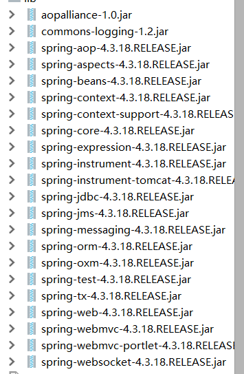
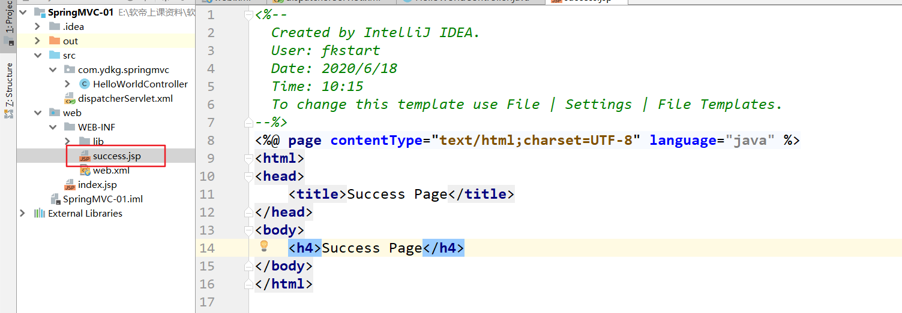
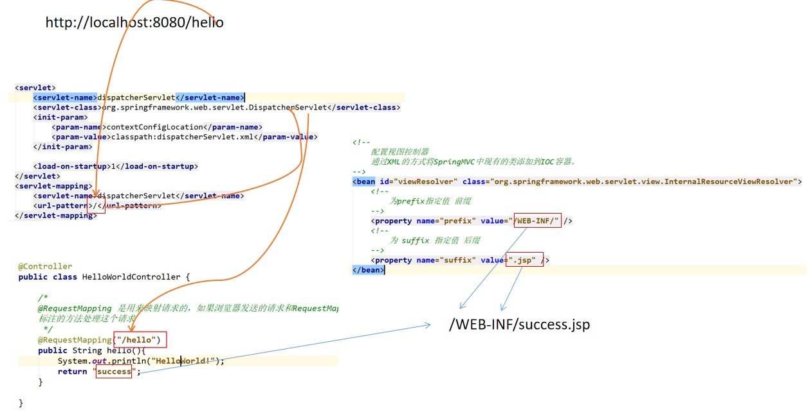

# SpringMVC

## 介绍

> Spring 为展现层提供的基于 MVC 设计理念的优秀的 
>
> Web 框架，是目前最主流的 MVC 框架之一 Spring3.0 后全面超越 Struts2，成为最优秀的 MVC 框架
>
>  Spring MVC 通过一套 MVC 注解，让 POJO 成为处理请求的控制器，而无须实现任何接口。 
>
> 支持 REST 风格的 URL 请求
>
> 采用了松散耦合可插拔组件结构，比其他 MVC 框架更具扩展性和灵活性

### MVC

是软件工程中的软件架构，**并不是设计模式**。

MVC： M（model,模型） V （view,视图） C （controller, 控制器）

模型用于保存模型数据

视图用于显示数据

控制器用户处理请求，业务

## HelloWorld

- 创建一个工程

- 导入相关jar包（如果使用的是idea下载的方式，会自动下载到你自己的工程中，只需调整jar包位置即可）

  

- 需要编写配置文件

  - web.xml配置文件 （如果使用IDEA下载的方式创建的项目会自动生成配置文件）

    ```XML
    <context-param>
      <param-name>contextConfigLocation</param-name>
      <param-value>/WEB-INF/applicationContext.xml</param-value>
    </context-param>
    <listener>
      <listener-class>org.springframework.web.context.ContextLoaderListener</listener-class>
    </listener>

    <servlet>
      <servlet-name>dispatcherServlet</servlet-name>
      <servlet-class>org.springframework.web.servlet.DispatcherServlet</servlet-class>
      <init-param>
        <param-name>contextConfigLocation</param-name>
        <param-value>classpath:dispatcherServlet.xml</param-value>
      </init-param>
      <load-on-startup>1</load-on-startup>
    </servlet>
    <servlet-mapping>
      <servlet-name>dispatcherServlet</servlet-name>
      <url-pattern>/</url-pattern>
    </servlet-mapping>
    ```

  - 编写 SpringMVC 的核心配置文件

    - 配置自动扫描的包

      ```XML
      <!--
          配置自动扫描的包
          会自动扫描bask-package指定的包下被指定注解修饰的类，扫描到之后，会将其添加到IOC容器中
      -->
          <context:component-scan base-package="com.ydkg.springmvc"></context:component-scan>
      ```

    - 配置视图控制器

      ```XML
      <!--
              配置视图控制器
              通过XML的方式将SpringMVC中现有的类添加到IOC容器。
          -->
          <bean id="viewResolver" class="org.springframework.web.servlet.view.InternalResourceViewResolver">
              <!--
                  为prefix指定值 前缀
              -->
              <property name="prefix" value="/WEB-INF/pages/" />
              <!--
                  为 suffix 指定值 后缀
              -->
              <property name="suffix" value=".jsp" />
          </bean>
      ```

- 编写控制器

  ```java
  @Controller
  public class HelloWorldController { 
      /*
      @RequestMapping 是用来映射请求的，如果浏览器发送的请求和RequestMapping中的值一致，就使用该注解
      标注的方法处理这个请求
       */
      @RequestMapping("/hello")
      public String hello(){
          System.out.println("HelloWorld!");
          return "success";
      }
  }
  ```

- 在WEB-INFO目录下创建一个success.jsp

  


## HelloWorld原理



