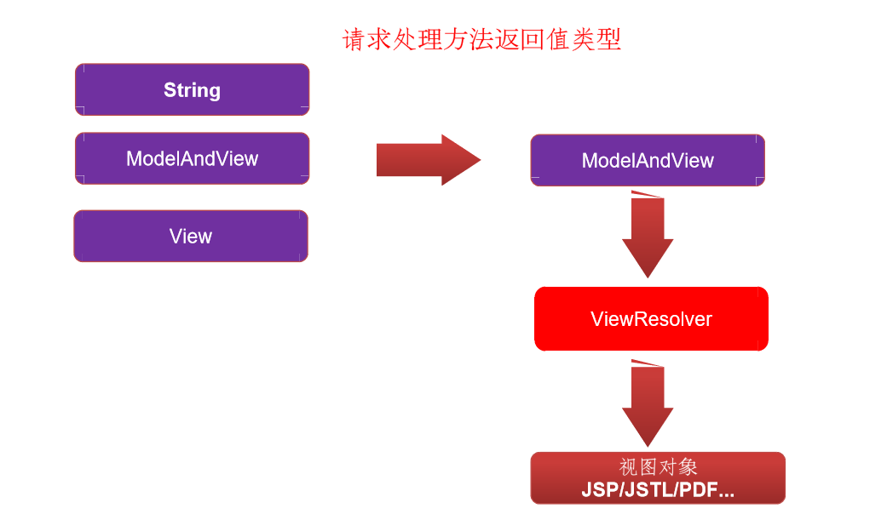

# SpringMVC

## 介绍

> Spring 为展现层提供的基于 MVC 设计理念的优秀的 
>
> Web 框架，是目前最主流的 MVC 框架之一 Spring3.0 后全面超越 Struts2，成为最优秀的 MVC 框架
>
>  Spring MVC 通过一套 MVC 注解，让 POJO 成为处理请求的控制器，而无须实现任何接口。 
>
> 支持 REST 风格的 URL 请求
>
> 采用了松散耦合可插拔组件结构，比其他 MVC 框架更具扩展性和灵活性

### MVC

是软件工程中的软件架构，**并不是设计模式**。

MVC： M（model,模型） V （view,视图） C （controller, 控制器）

模型用于保存模型数据

视图用于显示数据

控制器用户处理请求，业务

## HelloWorld

- 创建一个工程

- 导入相关jar包（如果使用的是idea下载的方式，会自动下载到你自己的工程中，只需调整jar包位置即可）

  

- 需要编写配置文件

  - web.xml配置文件 （如果使用IDEA下载的方式创建的项目会自动生成配置文件）

    ```XML
    <context-param>
      <param-name>contextConfigLocation</param-name>
      <param-value>/WEB-INF/applicationContext.xml</param-value>
    </context-param>
    <listener>
      <listener-class>org.springframework.web.context.ContextLoaderListener</listener-class>
    </listener>

    <servlet>
      <servlet-name>dispatcherServlet</servlet-name>
      <servlet-class>org.springframework.web.servlet.DispatcherServlet</servlet-class>
      <init-param>
        <param-name>contextConfigLocation</param-name>
        <param-value>classpath:dispatcherServlet.xml</param-value>
      </init-param>
      <load-on-startup>1</load-on-startup>
    </servlet>
    <servlet-mapping>
      <servlet-name>dispatcherServlet</servlet-name>
      <url-pattern>/</url-pattern>
    </servlet-mapping>
    ```

  - 编写 SpringMVC 的核心配置文件

    - 配置自动扫描的包

      ```XML
      <!--
          配置自动扫描的包
          会自动扫描bask-package指定的包下被指定注解修饰的类，扫描到之后，会将其添加到IOC容器中
      -->
          <context:component-scan base-package="com.ydkg.springmvc"></context:component-scan>
      ```

    - 配置视图控制器

      ```XML
      <!--
              配置视图控制器
              通过XML的方式将SpringMVC中现有的类添加到IOC容器。
          -->
          <bean id="viewResolver" class="org.springframework.web.servlet.view.InternalResourceViewResolver">
              <!--
                  为prefix指定值 前缀
              -->
              <property name="prefix" value="/WEB-INF/pages/" />
              <!--
                  为 suffix 指定值 后缀
              -->
              <property name="suffix" value=".jsp" />
          </bean>
      ```

- 编写控制器

  ```java
  @Controller
  public class HelloWorldController { 
      /*
      @RequestMapping 是用来映射请求的，如果浏览器发送的请求和RequestMapping中的值一致，就使用该注解
      标注的方法处理这个请求
       */
      @RequestMapping("/hello")
      public String hello(){
          System.out.println("HelloWorld!");
          return "success";
      }
  }
  ```

- 在WEB-INFO目录下创建一个success.jsp

  

### 关于DispacherServlet 路径的配置

```Xml
<servlet>
  <servlet-name>dispatcher</servlet-name>
  <!--
            DispatcherServlet 是SpringMVC的核心
        -->
  <servlet-class>org.springframework.web.servlet.DispatcherServlet</servlet-class>
  <!--
            可以使用初始化参数指定 SpringMVC 核心配置文件的路径
            如果没有指定SpringMVC核心配置文件的路径，则默认是在WEB-INF目录下去找
            当前 <servlet-name> -servlet.xml文件作为SpringMVC的核心配置文件
        -->
  <init-param>
    <param-name>contextConfigLocation</param-name>
    <param-value>classpath:dispatcher-servlet.xml</param-value>
  </init-param>
  <!--
            表示Servlet在web容器加载的时候就开始生效
        -->
  <load-on-startup>1</load-on-startup>
</servlet>
<servlet-mapping>
  <servlet-name>dispatcher</servlet-name>
  <url-pattern>/</url-pattern>
</servlet-mapping>
```


## HelloWorld原理


## @RequestMapping

- 可以修饰在方法处，也可以修饰在类定义处

>  类定义处：提供初步的请求映射信息。相对于  WEB 应用的根目录–
>
>  方法处：提供进一步的细分映射信息。相对于类定义处的 URL。若– 类定义处未标注 @RequestMapping，则方法处标记的 URL 相对于 WEB 应用的根目录

### 属性

- value : 指请求的url, 根据请求的url确定请求受理的方法

- method : 根据请求的方式确定请求受理的方法

  ```Java
  @RequestMapping(value = "/hello", method = {RequestMethod.POST})
  public String hello(){
    System.out.println("HelloWorld!");
    return "success";
  }
  ```

  注：如果请求方法不匹配会出现以下情况

  

  **以下两个属性作为了解。**

- params : 根据请求携带的参数确定受理请求的方法

  ```Java
  /*
  params属性
              根据请求的参数确定请求受理的方法
              params属性是一个字符串类型的数组，支持一些简单的表达式 !  =  !=
  */
  @RequestMapping(value = "/testParam", params = {"name!=zhangsan","age"})
  public String testParam(){
    return "success";
  }
  ```

- headers : 根据请求头中携带的参数确定请求受理的方法

  ```Java
  /*
  headers 属性
              根据请求头中的参数确定请求受理的方法
              headers 属性是一个字符串类型的数组，支持一些简单的表达式 !  =  !=
  */
  @RequestMapping(value = "/testHeaders",headers = {"Accept-Language=zh-CN,zh;q=0.9,en-US;q=0.8,en;q=0.7"})
  public String testHeaders(){
    return "success";
  }
  ```

## 统配符映射

```Java
/*
请求路径支持通配符映射
            使用一个通配符路径映射请求到受理请求的方法
            ? 表示匹配一个任意字符
            * 表示匹配一层路径中的任意多个字符
            ** 表示匹配多层路径中的任意字符
*/
@RequestMapping("/**/testAnt?")
public String testAnt(){
  return "success";
}
```

## @PathVariable 注解

>```
>@PathVariable 的使用
>    如果需要映射路径中的参数，
>    首先需要使用占位符将参数取名, 例如 {占位名}
>    其次需要在目标受理请求的入参中使用@PathVariable注解将参数绑定给方法入参
>```

```html
<body>
    <a href="/testPathVariable/2">Test PathVariable</a>
  </body>
```

```java
@RequestMapping("/testPathVariable/{id}")
public String testPathVariable(@PathVariable("id") Integer id){
  System.out.println("从路径中获取的参数为:" + id);
  return "success";
}
```

## Rest 请求

>  HTTP 协议里面，四个表示操作方式的动词：GET、POST、PUT、DELETE。它们分别对应四种基本操作：GET 用来获取资源，POST 用来新建资源，PUT 用来更新资源，DELETE 用来删除资源

### 发送 PUT 及 DELETE 请求

- 配置好 HiddentHttpMethodFilter 过滤器

  ```xml
  <!--
          配置 HiddenHttpMethodFilter
              用于将浏览器发送的 POST 请求转换为 PUT 及 DELETE 请求
      -->
  <filter>
    <filter-name>HiddenHttpMethodFilter</filter-name>
    <filter-class>org.springframework.web.filter.HiddenHttpMethodFilter</filter-class>
  </filter>
  <filter-mapping>
    <filter-name>HiddenHttpMethodFilter</filter-name>
    <url-pattern>/*</url-pattern>
  </filter-mapping>
  ```

- 需要发送一个 POST 请求

- 需要在 POST 请求中携带一个请求参数 _method 值是 PUT 或 DELETE

  ```HTML
  Delete 请求: <form method="post" action="/testRest">
    <input type="hidden" name="_method" value="DELETE" />
    <input type="submit" value="Test DELETE">
  </form>
  <hr>
  Put 请求：<form method="post" action="/testRest">
    <input type="hidden" name="_method" value="PUT" />
    <input type="submit" value="Test Put">
  </form>
  ```

## 获取请求参数

使用@RequestParam注解作为目标方法的入参，用于获取请求中的参数

属性：

- value 请求中参数的名称 

  注： 如果，请求中的参数和目标方法的入参名一致，可以省略@RequestParam注解

- required 表示参数是否是必须的

- defaultValue 参数的默认值

  **出现以下异常的原因为，没有传递相应的参数**


## @RequestHeader

获取请求报文中的参数。使用方式同@RequestParam

```Java
@RequestMapping("/testRequestHeader")
public String testRequestHeader(@RequestHeader("Accept-Language") String lg,
                                @RequestHeader("Cookie") String cookie){
  System.out.println("lg = " + lg);
  System.out.println("cookie = " + cookie);
  return "success";
}
```

## @CookieValue

获取Cookie中的数据， 使用方式同@RequestParam

```Java
@RequestMapping("/testCookieValue")
public String testCookieValue(@CookieValue("JSESSIONID") String jid){
  System.out.println("jid = " + jid);
  return "success";
}
```

## 使用普通的Java类作为入参

> 可以使用普通的java类作为方法的入参。会将请求参数中和Java类属性名称相同的参数赋值为对应的属性

```Java
@RequestMapping("/testPojo")
public String testPojo(Person person){
  System.out.println("person = " + person);
  return "success";
}
```

前台表单：

打印结果：

## 使用原生的ServletAPI

可以在目标受理请求的方法入参中加入原生的ServletAPI作为入参，即可使用原生ServletAPI

支持的ServletAPI有

- HttpServletRequest
- HttpServletResponse
- HttpSession
- java.security.Principal
- Locale• InputStream
- OutputStream
- Reader
- Writer

### 原理：

在调用目标受理请求方法时，SpringMVC会判断参数中是否有指定原生ServletAPI类型的参数，如果有，就传入给目标方法，所以目标方法即可使用了

```Java
if (!ServletRequest.class.isAssignableFrom(parameterType) && !MultipartRequest.class.isAssignableFrom(parameterType)) {
  if (ServletResponse.class.isAssignableFrom(parameterType)) {
    this.responseArgumentUsed = true;
    nativeResponse = webRequest.getNativeResponse(parameterType);
    if (nativeResponse == null) {
      throw new IllegalStateException("Current response is not of type [" + parameterType.getName() + "]: " + response);
    } else {
      return nativeResponse;
    }
  } else if (HttpSession.class.isAssignableFrom(parameterType)) {
    return request.getSession();
  } else if (Principal.class.isAssignableFrom(parameterType)) {
    return request.getUserPrincipal();
  } else if (Locale.class == parameterType) {
    return RequestContextUtils.getLocale(request);
  } else if (InputStream.class.isAssignableFrom(parameterType)) {
    return request.getInputStream();
  } else if (Reader.class.isAssignableFrom(parameterType)) {
    return request.getReader();
  } else if (OutputStream.class.isAssignableFrom(parameterType)) {
    this.responseArgumentUsed = true;
    return response.getOutputStream();
  } else if (Writer.class.isAssignableFrom(parameterType)) {
    this.responseArgumentUsed = true;
    return response.getWriter();
  } else {
    return super.resolveStandardArgument(parameterType, webRequest);
  }
```

snipaste20200618_165323.png

## 处理模型数据

### 处理模型数据之一

使用ModelAndView作为受理请求方法的返回值

```Java
/*
    处理模型数据之一：
        使用 ModelAndView 作为目标受理请求方法的返回值时，可以向ModelAndView中添加模型数据，
    添加的模型数据会自动的输出到Request域对象中
     */
@RequestMapping("/testModelAndView")
public ModelAndView testModelAndView(){
  ModelAndView model = new ModelAndView("success");
  model.addObject("school","yuandagaoke");
  return model;
}
```

### 处理模型数据之二

使用 **Map**、HashMap、 LindedHashMap、ModeMap、ExtendedModeMap、Model作为方法入参

```Java
 /*
    处理模型数据之二：
       使用 Map 或 Model 作为目标方法的入参  非常重要

       因为SpringMVC为我们传入的参数为 BindingAwareModeMap
       所以可以使用它的父类接受这个参数，HashMap LindedHashMap、ModeMap、
       ExtendedModeMap都可以作为受理请求方法入参来处理模型数据
     */
@RequestMapping("/testModel")
public String testModel(Model model){
  model.addAttribute("school","ydgk");

  return "success";
}
```

### 处理模型数据之三

**使用 @SessionAttributes 注解将模型中的数据暂存到 HttpSession 中**

```Java
@Controller
/*
    @SessionAttributes 注解可以将模型中的数据暂存到 HttpSession 中
        value 属性是根据模型中数据的键名称暂存的
        types 属性模型中数据的类型暂存
 */
@SessionAttributes(value = {"user"}, types = {String.class})
public class DispatcherController {

    @RequestMapping("/testSessionAttribute")
    public String testSessionAttribute(Map map){
        map.put("user",new User(1,"zhangsan","zhangsan@qq.com",18));
        map.put("school", "ydgk");
        return "success";
    }
}
```


### 处理模型数据之四

使用 @ModelAttribute 注解

- **在方法定义上使用 @ModelAttribute 注解：Spring MVC在调用目标处理方法前，会先逐个调用在方法级上标注了 @ModelAttribute 的方法。** 


- 在方法的入参前使用 @ModelAttribute 注解：
  - 可以从隐含对象中获取隐含的模型数据中获取对象，再将请求参数
  - 绑定到对象中，再传入入参 将方法入参对象添加到模型中

```Java
/*
    @ModelAttribute 注解可以修饰方法
        修饰方法时，会在任何目标受理请求方法调用之前调用
        在 ModelAttribute注 解修饰的方法中可以向模型中存入数据，
        存入的数据可能会作为前台数据存入的模板

    注意： SpringMVC 在调用受理请求方法之前会在模型中取出参数类型首字母小写的数据，作为方法的入参。

    总结ModelAttribute注解作用流程：
        1、从数据库中取出 User , 将 User 存入模型对象中
        2、SpringMVC 一定在某个时刻将模型中的数据取出，作为接收前台表单中传入的值。
        3、SpringMVC将模型中的 user 作为方法的入参
     */
@ModelAttribute
public void getUser(@RequestParam("id") Integer id,
                    Map map){
  System.out.println("DispatcherController.getUser");
  if(id != null){
    //从数据库中取出对应的对象    并将对象存入模型中
    map.put("user",new User(1,"zhangsan","zhangsan@qq.com",18));
  }
}

@RequestMapping("/testModelAttribute")
public String testModelAttribute(User user){
  System.out.println("修改User为："+ user);
  return "success";
}
```

### 由@SessionAttributes 注解引发的异常

如果目标受理请求的方法入参是一个POJO时，SpringMVC会先自动从模型中取出POJO类型首字母小写的模型数据使用，如果模型中不存在对应的数据，则会判断受理请求方法所在类是否被@SessionAttributes 注解修饰，如果修饰了，就会从HttpSession取出POJO类型首字母小写的键对应的值，如果取不到，就会报以下异常。


## ModelAttribute注解源码解析

```Java
private WebDataBinder resolveModelAttribute(String attrName, MethodParameter methodParam, ExtendedModelMap implicitModel, NativeWebRequest webRequest, Object handler) throws Exception {
  		// 将方法传入的 attrName 赋值给name, 传入的 attrName 是由入参是否被 @ModelAttribute 注解的value属性决定
        String name = attrName;
  		// 如果参数没有被@ModelAttribute注解修饰
        if ("".equals(attrName)) {
          // 会根据参数类型的首字母小写确定 name
            name = Conventions.getVariableNameForParameter(methodParam);
        }

        Class<?> paramType = methodParam.getParameterType();
        Object bindObject;
  		// 判断模型中是否存在 name 对应的数据
        if (implicitModel.containsKey(name)) {
          	// 如果存在
            bindObject = implicitModel.get(name);
          // 如果不存在，继续判断受理请求方法所在类是否被@SessionAttributes注解修饰
        } else if (this.methodResolver.isSessionAttribute(name, paramType)) {
          // 如果被修饰了... SpringMvc会尝试从HttpSession中获取name对应的数据给到bindObject
            bindObject = this.sessionAttributeStore.retrieveAttribute(webRequest, name);
            if (bindObject == null) {
              // 如果在Session中依然没有取出对应的值，则抛出异常
                this.raiseSessionRequiredException("Session attribute '" + name + "' required - not found in session");
            }
          // 如果在模型中没有name对应的数据，并且方法所在类也没有被@SessionAttributes注解修饰
        } else {
          	// 直接通过反射创建新的实例作为创建WebDataBinder的参考
            bindObject = BeanUtils.instantiateClass(paramType);
        }
		// 通过确定bindObject 和 name 创建 webDataBinder  前台表单中传入的数据都是通过数据绑定器绑定的。
        WebDataBinder binder = this.createBinder(webRequest, bindObject, name);
        this.initBinder(handler, name, binder, webRequest);
        return binder;
    }
```

## 视图解析器

### 视图解析器的工作示意图




- 请求处理方法执行完成后，最终返回一个 ModelAndView 对象。对于那些返回 String，View 或 ModeMap 等类型的处理方法，**Spring MVC 也会在内部将它们装配成一个 ModelAndView 对象**，它包含了<u>逻辑名和模型对象的视图</u> 
- Spring MVC 借助视图解析器（ViewResolver）得到最终的视图对象（View），最终的视图可以是 JSP ，也可能是 Excel、JFreeChart  等各种表现形式的视图 
- 对于最终究竟采取何种视图对象对模型数据进行渲染，处理器并不关心，处理器工作重点聚焦在生产模型数据的工作上，从而实现 MVC 的充分解耦

### 视图

- 视图的作用是渲染模型数据，将模型里的数据以某种形式呈现给客户。 

- 为了实现视图模型和具体实现技术的解耦，Spring 在 org.springframework.web.servlet 包中定义了一个高度抽象的 View 接口：

  

- 视图对象由视图解析器负责实例化。由于视图是**无状态**的，所以他们不会有线程安全的问题

  #### 常用的视图接口实现类

**使用 JstlView**，在SpringMVC中只需要在工程中导入 JST L相关 Jar 包即可使用JSTL视图。


### 使用国际化

1、配置国际化资源文件


2、在 SpringMVC 中配置 ResourceBundleMessageSource 对应的Bean

```java
<!--
    如果使用国际化，需要配置国际化资源文件的Bean
-->
<bean id="messageSource" class="org.springframework.context.support.ResourceBundleMessageSource">
    <property name="basename" value="i8n"></property>
</bean>
```

3、在页面中就可以使用国际化标签了<fmt:message>

```html
<fmt:message key="i18n.password"></fmt:message>
<br>
<fmt:message key="i18n.username"></fmt:message>
```

**注意：在使用属性文件之前一定要确认properties文件的编码集是否为UTF-8，**设置如下


### 视图解析器

- SpringMVC 为逻辑视图名的解析提供了不同的策略，可以在 Spring WEB 上下文中配置一种或多种解析策略，并指定他们之间的先后顺序。
- 每一种映射策略对应一个具体 的视图解析器实现类。 视图解析器的作用比较单一：将逻辑视图解析为一个具体的视图对象。 
- 所有的视图解析器都必须实现 ViewResolver 接口


#### 使用BeanNameViewResolver

1、在SpringMVC的核心配置文件中加入 BeanNameViewResolver的配置,并指定优先级。

```Xml
    <!--
        配置 BeanNameViewResolver 通过Bean名称解析视图
    -->
    <bean class="org.springframework.web.servlet.view.BeanNameViewResolver">
        <!--
            通过order属性指定视图解析器的优先级
                值越小，优先级越高
        -->
        <property name="order" value="200"></property>
    </bean>
```

2、自定义一个类，实现 View 接口或View接口的抽象类。

```Java
@Component
public class MyView implements View {
    /*
    视图返回的类型
     */
    @Override
    public String getContentType() {
        return "html/text";
    }
    /*
    渲染视图的方法
     */
    @Override
    public void render(Map<String, ?> map, HttpServletRequest httpServletRequest, HttpServletResponse httpServletResponse) throws Exception {
        httpServletResponse.getWriter().write("This My View~~~~~~");
    }
}
```

3、在受理请求方法返回的虚拟视图名设置为自定义视图的名称

### 视图映射

如果希望将一个请求直接转发到WEB-INF目录下的资源，可以使用 <mvc:view-controller> 配置

```XML
<!--配置视图映射-->
<mvc:view-controller path="/toInput" view-name="input"></mvc:view-controller>

<!--
    一般在开发过程中会配置一个标配 
-->
<mvc:annotation-driven></mvc:annotation-driven>
```

### 重定向

在返回的虚拟视图前使用 redirect: 开头即可将请求重定向。

源码：

```java
protected View createView(String viewName, Locale locale) throws Exception {
  if (!this.canHandle(viewName, locale)) {
    return null;
  } else {
    String forwardUrl;
    // 判断返回的虚拟视图是否以 redirect: 开头
    if (viewName.startsWith("redirect:")) {
      forwardUrl = viewName.substring("redirect:".length());
      RedirectView view = new RedirectView(forwardUrl, this.isRedirectContextRelative(), this.isRedirectHttp10Compatible());
      view.setHosts(this.getRedirectHosts());
      return this.applyLifecycleMethods(viewName, view);
      // 判断返回的虚拟视图是否以 forward: 开头
    } else if (viewName.startsWith("forward:")) {
      forwardUrl = viewName.substring("forward:".length());
      return new InternalResourceView(forwardUrl);
    } else {
      return super.createView(viewName, locale);
    }
  }
}
```

## SpringMVC的表单标签

>  通过 SpringMVC 的表单标签可以实现将模型数据中的属性和 HTML 表单元素相绑定，以实现表单数据更**便捷编辑**和**表单值的回显**


```html
<h4>Input Page</h4>
    <%--
        SpringMVC的表单标签默认所有的表单都需要回显。如果没有回显，就会报错

        SpringMVC 提供的表单标签有:
            form:from 标签： 是用来构建一个 form 表单的
                属性：
                    action: 表单提交的路径
                    method: 表单提交的方式
                    modelAttribute: 指定将模型数据中的数据在表单中进行回显
            form:input 标签： 相当于 input 标签
                属性：
                    path: 指定模型数据中的属性名, 相当于 input 标签中的name属性
            form:select 标签： 用于构建下拉列表
                属性：
                    items: 表示遍历的对象集合
                    itemLabel： 使用对象中的那个字段显示
                    itemValue： 使用对象中的那个字段进行提交作为值
                    path： 相当于name属性
           form:radiobuttons 标签： 用于构建一组单选按钮
                    如果想items属性中放入一个Map 将会以 map中属性的键作为单选按钮的value
                    以键的值作为显示的名称

    --%>
    <form:form action="/testCommit" method="post" modelAttribute="user">
        Name: <form:input path="name" />
        <br>
        Email: <form:input path="email" />
        <br>
        age: <form:input path="age" />
        <br>
        <%
            HashMap map = new HashMap();
            map.put(0,"Female");
            map.put(1,"Male");

            ArrayList list = new ArrayList();
            list.add("Female");
            list.add("male");
            request.setAttribute("gender",list);
        %>
        Gender: <form:radiobuttons path="gender" items="${gender}" delimiter="<br>"></form:radiobuttons>
        <br>
        <form:select path="department.id" items="${depts}" itemLabel="departmentName" itemValue="id" ></form:select>
        <input type="submit" value="提交" />
    </form:form>
```

### 处理静态资源

优雅的Restful风格的请求是不希望请求后跟.form、.do、.action。所以 SpringMVC 会配置拦截所有请求。静态资源路径也会被SpringMVC拦截处理。发现没有对应的映射就会报404找不到页面。

**解决办法：**

在SpringMVC的核心配置文件中配置一个<mvc:default-servlet-handler> 节点即可解决。

注意： 添加了该节点之后，必须保证配置了 <mvc:annotation-driven>

```XML
<!--
        处理静态资源的配置
    -->
<mvc:default-servlet-handler></mvc:default-servlet-handler>
<!--
        一般在开发过程中会配置一个标配
    -->
<mvc:annotation-driven></mvc:annotation-driven>
```

## 数据的绑定

通过超链接或表单提交到Controller层的请求数据，如何绑定给方法的入参的。

- 数据类型的转化 （提交的数据往往都是字符串）
- 数据的格式化
- 数据的校验

### 数据绑定的流程

- Spring MVC 主框架将 ServletRequest  对象及目标方法的入参实例传递给 WebDataBinderFactory 实例，以创建 DataBinder 实例对象 

- DataBinder 调用装配在 Spring MVC 上下文中的 ConversionService 组件进行数据类型转换、数据格式化工作。将 Servlet 中的请求信息填充到入参对象中 

- 调用 Validator 组件对已经绑定了请求消息的入参对象进行数据合法性校验，并最终生成数据绑定结果 BindingData 对象 

- Spring MVC 抽取 BindingResult 中的入参对象和校验错误对象，将它们赋给处理方法的响应入参

  源码：

```Java
Object attribute = mavContainer.containsAttribute(name) ? mavContainer.getModel().get(name) : this.createAttribute(name, parameter, binderFactory, webRequest);
// 根据request对象和目标方法入参实例创建 WebDataBinder 对象
WebDataBinder binder = binderFactory.createBinder(webRequest, attribute, name);
if (binder.getTarget() != null) {
  if (!mavContainer.isBindingDisabled(name)) {
    // 进行数据绑定
    this.bindRequestParameters(binder, webRequest);
  }
  // 进行数据的校验
  this.validateIfApplicable(binder, parameter);
  if (binder.getBindingResult().hasErrors() && this.isBindExceptionRequired(binder, parameter)) {
    throw new BindException(binder.getBindingResult());
  }
}
```

ConversionService  中转换器的内容


### 数据绑定流程示意图

Spring MVC 通过反射机制对目标处理方法进行解析，将请求消息绑定到处理方法的入参中。数据绑定的核心部件是 DataBinder，运行机制如下：


Binder 对象中的内容:


### 自定义类型转换器(了解)

- ConversionService 是 Spring 类型转换体系的核心接口。
- 可以利用 ConversionServiceFactoryBean 在 Spring 的 IOC 容器中定义一个 ConversionService. Spring 将自动识别出 IOC 容器中的 ConversionService，并在 Bean 属性配置及 Spring  MVC 处理方法入参绑定等场合使用它进行数据的转换 
- 可通过 ConversionServiceFactoryBean 的 converters 属性注册自定义的类型转换器

#### Spring 支持的转换器

Spring 定义了 3 种类型的转换器接口，实现任意一个转换•器接口都可以作为自定义转换器注册到 ConversionServiceFactroyBean 中： 

- **Converter<S,T>**：将 S 类型对象转为 T 类型对象
- ConverterFactory：将相同系列多个 “同质” Converter 封装在一 起。如果希望将一种类型的对象转换为另一种类型及其子类的对 象（例如将 String 转换为 Number 及 Number 子类 （Integer、Long、Double 等）对象）可使用该转换器工厂类 
- GenericConverter：会根据源类对象及目标类对象所在的宿主类– 中的上下文信息进行类型转换

自定义类型转换器步骤：

1、创建一个类实现Converter<S,T>接口，实现converter方法。

```java
@Component
public class StringToEmployeeConvertor implements Converter<String,Employee> {
    @Override
    public Employee convert(String s) {
        // 编写转换的逻辑  FF-ff@aliyun.com-0-1004
        if(s != null && !"".equals(s)){
            String[] strs = s.split("-");
            Employee employee = new Employee(null, strs[0], strs[1], Integer.parseInt(strs[2]), new Department(Integer.parseInt(strs[3]), null));
            return employee;
        }
        return null;
    }
}
```

2、在 SpringMVC 的配置文件中配置好自定义类型转换器。

```xml
<!-- 2、 将自定义的类型转换器注册到 ConversionServiceFactoryBean 中-->
<bean id="conversionService" class="org.springframework.context.support.ConversionServiceFactoryBean">
  <property name="converters">
    <ref bean="stringToEmployeeConvertor"></ref>
  </property>
</bean>
```

3、将配置好的 ConverterService 配置到mvc:annotaionDirver 的converter-service 属性中

```Xml
<!--3、需要将配置好的ConversionService配置到annotation-driven节点的conversion-service属性中-->
<mvc:annotation-driven conversion-service="conversionService"/>
```


## mvc:annotation-driven

<mvc:annotation-driven /> 会自动注册

- RequestMappingHandlerMapping
- **RequestMappingHandlerAdapter** 
- ExceptionHandlerExceptionResolver  三个bean。 

还将提供以下支持：

- 支持使用 **ConversionService** 实例对表单参数进行类型转换
- 支持使用 @NumberFormat annotation、@DateTimeFormat 
- 注解完成数据类型的格式化 支持使用 @Valid 注解对 JavaBean 实例进行 JSR 303 验证– 支持使用 @RequestBody 和 @ResponseBody 注解

注意：必须在项目中加入这个配置，开发时的一个标准配置


### @InitBinder 注解

```java
    /*
    因为数据的绑定，数据的校验及格式化都是通过webDataBinder对象进行控制的。
    而 @InitBinder 注解修饰方法可以用于控制 webDataBinder 的工作流程
       比如： 控制那些参数不被绑定到方法的入参
     */
//    @InitBinder
//    public void testInitBinder(WebDataBinder webDataBinder){
//        // 表示不去绑定lastName属性
//        webDataBinder.setDisallowedFields("lastName");
//    }
```


### 数据的格式化

SpringMVC 上下文中注册的 ConversionService 的类型可以是 DefaulteFormattingConversionService 类型。次类型的转换器支持数据的转换及数据的格式化。

FormattingConversionServiceFactroyBean 内部已经注册了 :

- NumberFormatAnnotationFormatterFactroy：支持对数字类型的属性– 使用 **@NumberForma**t 注解
- JodaDateTimeFormatAnnotationFormatterFactroy：支持对日期类型– 的属性使用 **@DateTimeFormat** 注解 

@NumberFomat 和 @DateTimeFormat 只需要标注在需要转换对象的属性上即可。

使用方法


### 数据的校验

SpringMVC 支持JSR303 标准校验框架， 他在自己本身校验框架的基础上实现了 JSR303 的标准。

JSR 303 通过在 Bean 属性上标注类似于 @NotNull、@Max 等标准的注解指定校验规则，并通过标准的验证接口对 Bean 进行验证


**HibernateValidata **

**Hibernate Validator** 是 JSR 303 的一个参考实现，除支持• 所有标准的校验注解外，它还支持以下的扩展注解


#### 校验使用的步骤

1、 导入JSR303 标准框架实现框架Jar包


2、在需要校验的实体类属性上标注对应对的注解

```java
public class Employee {
	private Integer id;
	@NotEmpty // 校验是否为空串或null      NotNull
	private String lastName;
	@Email
	private String email;
	//1 male, 0 female
	private Integer gender;
	private Department department;
	@Past // 校验是否是一个过去的时间
	@DateTimeFormat(pattern = "yyyy-MM-dd")
	private Date birth;
	@Range(min = 3000, max = 50000) // 校验数值是否在指定范围内
	@NumberFormat(pattern = "##,###")
	private Float salary;
```

3、在目标受理请求方法的入参实例POJO前加上@Valid 注解

校验即可使用。

#### 如何获取错误消息

在目标受理请求方法对应入参之后加入 BindingResult 类型的参数。即可通过这个对象获取数据校验或类型转换的错误结果。如果出现错误可以直接将页面转发至提交页面，在提交页面可以通过<form:errors> 获取错误消息。

```java
/*
    获取校验结果：
        在需要校验的入参后加入一个BindingResult或Error类型的参数，获取校验结果。
        注意： 该参数必须和校验对象挨着。
     */
@RequestMapping(value = "/emp", method = RequestMethod.POST)
public String save(@Valid Employee employee, BindingResult bindingResult,Map map) throws ServletException, IOException {

  /*
         BindingResult 对象的方法：
            hasErrors() 是否校验或转换出错
         */
  if(bindingResult.hasErrors()){
    List<FieldError> fieldErrors = bindingResult.getFieldErrors();
    for(FieldError error : fieldErrors){
      System.out.println("Employee的<"+error.getField()+">属性出现错误。" +
                         "错误消息为："+ error.getDefaultMessage());
    }
    // 获取所有的部门信息，存入模型中
    map.put("depts",departmentDao.getDepartments());
    //request.getRequestDispatcher("/WEB-INF/pages/input.jsp").forward(request,response);
    return "input";
  }
```

```Html
<form:form action="/emp" method="post" modelAttribute="employee">

  <%--<form:errors path="*"></form:errors>--%>

<%--如果是修改 1、保存员工的id  2、需要发送PUT请求--%>
  <c:if test="${!empty employee.id}">
    <form:hidden path="id" />
    <input type="hidden" name="_method" value="PUT" />
  </c:if>
  <c:if test="${empty employee.id}">
    LastName: <form:input path="lastName" /> <form:errors path="lastName"></form:errors>
  </c:if>
  <br>
  Email: <form:input path="email" /><form:errors path="email"></form:errors>
  <br>
  <%
     HashMap map = new HashMap();
     map.put(0,"Female");
     map.put(1,"Male");
     pageContext.setAttribute("map",map);
     %>
    Gender: <form:radiobuttons path="gender" items="${map}"></form:radiobuttons>
    <br>
    Department: <form:select path="department.id" items="${depts}"
                             itemValue="id" itemLabel="departmentName"></form:select>
    <br>
    Birth: <form:input path="birth"></form:input> <form:errors path="birth"></form:errors>
    <br>
    <%-- 10,000 --%>
      Salary: <form:input path="salary" /> <form:errors path="salary"></form:errors>
      <br>
      <input type="submit" value="Submit">
      </form:form>
```

### 错误消息国际化


